# H1E Release-Control Entity Relationship Diagram (ERD)

This document specifies the database schemas, relationships, cardinalities, and constraint definitions for Stage H1E Paymentless Pilot Control and Release Management.

---

## 1. Mermaid Entity-Relationship Diagram

```mermaid
erDiagram
    platform_global_release_control {
        integer id PK "CHECK (id = 1)"
        text release_phase "CHECK ('pre_pilot', 'paymentless_pilot', 'full_production')"
        boolean is_production_authorized "Default false"
        boolean is_pilot_enforcement_required "Default true"
        boolean is_payment_collection_enabled "Default false"
        boolean is_checkout_enabled "Default false"
        boolean is_iyzico_enabled "Default false"
        uuid updated_by FK "FK -> users_profile(id)"
        text updated_reason
        timestamptz updated_at
    }

    tenants {
        uuid id PK
        text name
        text slug UK
        text public_site_status "CHECK ('draft', 'pending_review', 'published', 'paused', 'suspended')"
        timestamptz created_at
    }

    tenant_pilot_authorizations {
        uuid id PK "gen_random_uuid()"
        uuid tenant_id FK "FK -> tenants(id) ON DELETE CASCADE"
        boolean is_approved "Default false"
        text approval_reason
        uuid approved_by FK "FK -> users_profile(id)"
        timestamptz approved_at
        text revocation_reason
        uuid revoked_by FK "FK -> users_profile(id)"
        timestamptz revoked_at
        integer version "Default 1"
        timestamptz created_at
        timestamptz updated_at
    }

    users_profile {
        uuid id PK "auth.uid() = id"
        uuid tenant_id FK "NULL for super_admin"
        text role "CHECK ('super_admin', 'tenant_owner', 'staff')"
        text email
    }

    subscriptions {
        uuid id PK
        uuid tenant_id FK "FK -> tenants(id)"
        text plan_code
        text status "CHECK ('pending_checkout', 'trialing', 'active', 'past_due', 'cancelled', 'paused', 'suspended', 'comped', 'manual_active', 'expired', 'none')"
        text billing_mode "CHECK ('manual', 'automated', 'comped')"
        timestamptz current_period_end
    }

    platform_system_restrictions {
        uuid id PK
        uuid tenant_id FK "NULL for GLOBAL"
        text feature_key "core_booking, etc."
        boolean is_restricted
        text reason
        timestamptz starts_at
        timestamptz expires_at
    }

    audit_events {
        uuid id PK
        text tenant_id
        text actor_id
        text actor_role
        text action
        text resource_type
        text resource_id
        jsonb payload
        timestamptz created_at
    }

    super_admin_commercial_mutation_idempotency {
        uuid id PK
        text idempotency_key UK
        uuid actor_user_id FK "FK -> auth.users(id)"
        text rpc_name
        text request_fingerprint
        jsonb response_payload
        timestamptz created_at
    }

    tenants ||--o{ tenant_pilot_authorizations : "has authorization history"
    tenants ||--o{ subscriptions : "has"
    tenants ||--o{ platform_system_restrictions : "may have tenant restriction"
    users_profile ||--o{ platform_global_release_control : "updates release control"
    users_profile ||--o{ tenant_pilot_authorizations : "approves/revokes pilot"
    tenants ||--o{ audit_events : "generates audit log"
    users_profile ||--o{ super_admin_commercial_mutation_idempotency : "executes idempotent RPC"
```



---

## 2. Table Schemas & Constraint Definitions

### A. `platform_global_release_control` (New in Migration 47)
```sql
CREATE TABLE IF NOT EXISTS public.platform_global_release_control (
    id INTEGER PRIMARY KEY DEFAULT 1 CHECK (id = 1),
    release_phase TEXT NOT NULL DEFAULT 'pre_pilot' CHECK (release_phase IN ('pre_pilot', 'paymentless_pilot', 'full_production')),
    is_production_authorized BOOLEAN NOT NULL DEFAULT false,
    is_pilot_enforcement_required BOOLEAN NOT NULL DEFAULT true,
    is_payment_collection_enabled BOOLEAN NOT NULL DEFAULT false,
    is_checkout_enabled BOOLEAN NOT NULL DEFAULT false,
    is_iyzico_enabled BOOLEAN NOT NULL DEFAULT false,
    updated_by UUID REFERENCES public.users_profile(id),
    updated_reason TEXT NOT NULL DEFAULT 'Initial migration seeding' CHECK (trim(updated_reason) != ''),
    updated_at TIMESTAMPTZ NOT NULL DEFAULT now(),

    -- Invariants Enforced by Constraints
    CONSTRAINT chk_checkout_requires_payment CHECK (NOT is_checkout_enabled OR is_payment_collection_enabled),
    CONSTRAINT chk_iyzico_requires_checkout CHECK (NOT is_iyzico_enabled OR is_checkout_enabled),
    CONSTRAINT chk_iyzico_requires_payment CHECK (NOT is_iyzico_enabled OR is_payment_collection_enabled),
    CONSTRAINT chk_paymentless_pilot_no_payments CHECK (
        release_phase != 'paymentless_pilot' OR (
            NOT is_payment_collection_enabled AND NOT is_checkout_enabled AND NOT is_iyzico_enabled
        )
    )
);
```

### B. `tenant_pilot_authorizations` (New in Migration 48)
```sql
CREATE TABLE IF NOT EXISTS public.tenant_pilot_authorizations (
    id UUID PRIMARY KEY DEFAULT gen_random_uuid(),
    tenant_id UUID NOT NULL REFERENCES public.tenants(id) ON DELETE CASCADE,
    is_approved BOOLEAN NOT NULL DEFAULT false,
    approval_reason TEXT NOT NULL CHECK (trim(approval_reason) != ''),
    approved_by UUID NOT NULL REFERENCES public.users_profile(id),
    approved_at TIMESTAMPTZ NOT NULL DEFAULT now(),
    revocation_reason TEXT CHECK (revocation_reason IS NULL OR trim(revocation_reason) != ''),
    revoked_by UUID REFERENCES public.users_profile(id),
    revoked_at TIMESTAMPTZ,
    version INTEGER NOT NULL DEFAULT 1 CHECK (version >= 1),
    created_at TIMESTAMPTZ NOT NULL DEFAULT now(),
    updated_at TIMESTAMPTZ NOT NULL DEFAULT now(),

    CONSTRAINT chk_revocation_consistency CHECK (
        (revoked_at IS NULL AND revoked_by IS NULL AND revocation_reason IS NULL) OR
        (revoked_at IS NOT NULL AND revoked_by IS NOT NULL AND revocation_reason IS NOT NULL)
    )
);

-- Partial Unique Index: Ensures at most ONE active (unrevoked) pilot authorization per tenant
CREATE UNIQUE INDEX IF NOT EXISTS idx_tenant_pilot_auth_active_unique 
ON public.tenant_pilot_authorizations (tenant_id) 
WHERE revoked_at IS NULL AND is_approved = true;

-- Index for efficient tenant history lookups
CREATE INDEX IF NOT EXISTS idx_tenant_pilot_auth_tenant_created 
ON public.tenant_pilot_authorizations (tenant_id, created_at DESC);
```

---

## 3. Cardinalities & Integrity Rules

| Relationship | Cardinality | Integrity & Cascade Rule |
| :--- | :---: | :--- |
| `tenants` → `tenant_pilot_authorizations` | `1 : N` | `ON DELETE CASCADE` on `tenant_id`. History records preserved across cycles. Partial unique index enforces max `1` active cycle (`revoked_at IS NULL AND is_approved = true`). |
| `users_profile` → `platform_global_release_control` | `1 : N` | `updated_by` references Super Admin profile ID. |
| `users_profile` → `tenant_pilot_authorizations` | `1 : N` | `approved_by` and `revoked_by` reference Super Admin profile ID. |
| `tenants` → `audit_events` | `1 : N` | `audit_events.tenant_id` stores tenant UUID as text. Audit log is append-only. |
| `users_profile` → `super_admin_commercial_mutation_idempotency` | `1 : N` | `actor_user_id` references `auth.users(id)`. Unique constraint on `idempotency_key`. |
